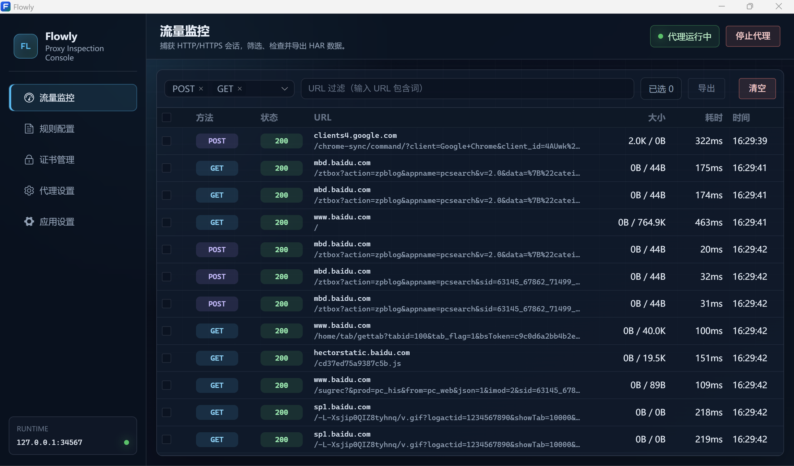
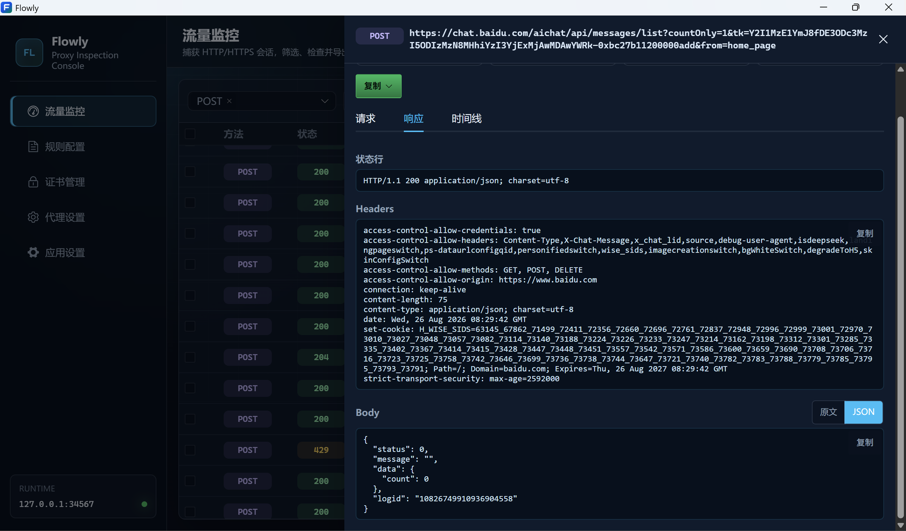
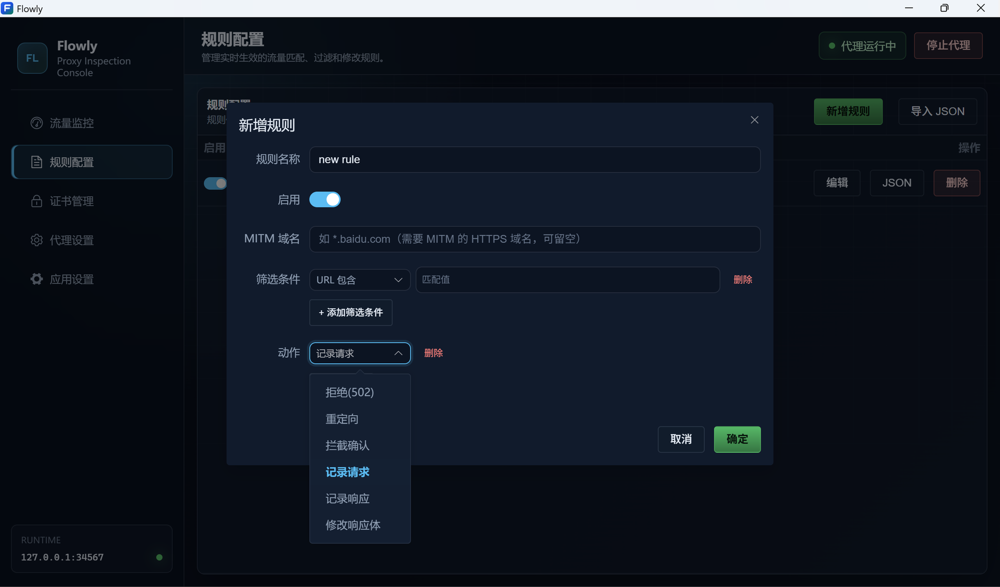
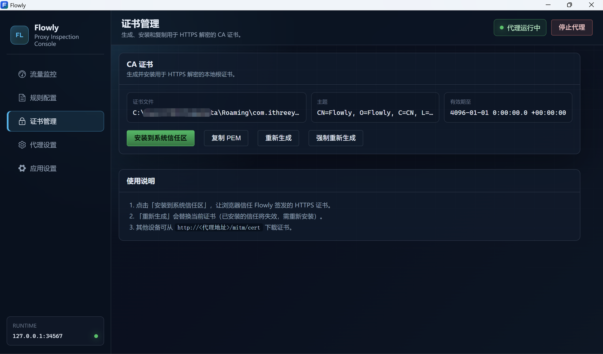

# Flowly

[中文文档](./README.md)

Flowly is a local-debugging HTTP/HTTPS proxy and MITM tool. It consists of a Rust proxy core and a Tauri + Vue desktop workbench for inspecting network sessions, debugging requests and responses, intercepting traffic with rules, and exporting HAR data.

> Only use MITM, request modification, and certificate decryption on traffic you own or are explicitly authorized to inspect.

## Current Capabilities

### Traffic Monitor



- Start or stop the local HTTP/HTTPS proxy
- Listens on `127.0.0.1:34567` by default
- View request method, status code, URL, request/response size, duration, and timestamp
- Filter by HTTP method and URL keywords
- Batch delete or clear selected sessions
- Open details to inspect request headers, response headers, request body, and response body
- Copy URL or generate cURL commands
- Export selected sessions as HAR files
- Replay requests via context menu
- Real-time session status display (pending, success, failed) with status icons and loading animation



Once the proxy is running, clients need to use Flowly's listening address as their HTTP proxy. The desktop app can automatically set the system proxy on startup and restore it on stop, based on configuration; this currently targets Windows primarily.

### Rule Configuration



Rules can be created via a form or the advanced JSON editor. Once saved, rules are persisted immediately and hot-reloaded into the proxy.

Supported match conditions:

- All requests
- Exact domain
- Domain keyword
- Domain prefix
- Domain suffix
- URL contains
- URL regex

Supported actions:

- Reject request with `502`
- Redirect
- Intercept and await confirmation
- Log request or response
- Modify response body

Rules can also specify which HTTPS domains require decryption via `mitmList`. Rule files are JSON, and the desktop app supports importing a single rule or a rule array.

Example:

```json
{
  "name": "Log example domain requests",
  "enabled": true,
  "mitmList": "*.example.com",
  "filters": [
    { "domainSuffix": "example.com" }
  ],
  "actions": [
    "logReq"
  ]
}
```

### CA Certificate Management



HTTPS MITM requires a local root certificate. The Flowly desktop app can:

- View current CA certificate status
- Generate or regenerate the CA certificate
- Install it to the system trust store
- Copy the PEM certificate content
- Provide a certificate download entry via the proxy address: `http://<proxy-address>/mitm/cert`

Regenerating the certificate invalidates previously installed trust relationships and requires reinstallation.

### Proxy & App Settings

- Configure listening address
- Configure an optional upstream proxy
- Toggle automatic system proxy takeover
- Toggle request/response body collection and set max collection size
- Adjust desktop workbench font size

## Using the Desktop App

### Prerequisites

- Windows
- Rust toolchain
- Node.js and npm
- Tauri 2 native build dependencies

### Install Dependencies

```powershell
cd app
npm install
```

### Start Development Build

```powershell
cd app
npm run tauri dev
```

Start the frontend dev server only:

```powershell
cd app
npm run dev
```

Default address is `http://localhost:1420`. Running Vite alone only previews the UI — proxy control, certificates, and file operations require Tauri capabilities available via `npm run tauri dev`.

### Build Desktop Installer

```powershell
cd app
npm run tauri build
```

Frontend production build:

```powershell
cd app
npm run build
```

## Using the Rust CLI

The repository also includes a Rust CLI that does not depend on the desktop UI. The CLI requires a CA private key and certificate.

### Generate CA

```powershell
cargo run -- genca
```

Default files are generated at:

- `ca/private.key`
- `ca/cert.crt`

### Start Proxy

```powershell
cargo run -- run -r rules/modify.json
```

Common parameters:

```text
--key,  -k    CA private key path, default ca/private.key
--cert, -c    CA certificate path, default ca/cert.crt
--rule, -r    Rule JSON file or directory
--bind, -b    Listen address, default 127.0.0.1:34567
--proxy, -p   Optional upstream proxy, e.g. http://127.0.0.1:7890
```

Example:

```powershell
cargo run -- run `
  --key ca/private.key `
  --cert ca/cert.crt `
  --rule rules `
  --bind 127.0.0.1:34567 `
  --proxy http://127.0.0.1:7890
```

CLI rule loading supports a single JSON file or a directory. Rule files in a directory are merged and loaded together.

## HTTPS Usage Notes

1. Generate the Flowly CA certificate.
2. Install the CA certificate into the OS or target browser's trust store.
3. Start the Flowly proxy.
4. Set your browser or client's HTTP/HTTPS proxy to `127.0.0.1:34567`.
5. View sessions on the Traffic Monitor page.

If you only need to inspect HTTP traffic, you can skip CA certificate installation. To decrypt HTTPS, the target domain must be included in a rule's `mitmList`, and the client must trust the Flowly CA.

## Project Structure

```text
.
├── app/                 Tauri + Vue desktop workbench
│   ├── src/             Pages, components, and frontend state
│   └── src-tauri/       Proxy control, certificates, rules, and system proxy commands
├── crates/core/         HTTP/HTTPS proxy and MITM core
├── crates/rule/         Rule matching and request/response processing
├── crates/trust_cert/   System trust store certificate installation
├── src/                 Rust CLI entry point
├── ca/                  Local CA file directory
└── rules/               Example rules
```

## Notes

- MITM generates temporary certificates for target domains; these must be trusted by the client for HTTPS to work.
- Collecting request/response bodies increases memory usage; the desktop app allows setting a maximum collection size.
- Rules take effect immediately after saving; incorrect rules may cause requests to be rejected or content to be rewritten.
- Before stopping the proxy, confirm that the system proxy has been restored; Flowly runs restoration logic on normal shutdown.
- Transparent proxy is not the desktop app's default workflow; forwarding rules must be configured per operating system.

## Acknowledgements

Flowly is developed based on [Good-MITM](https://github.com/zu1k/Good-MITM). Thanks to the original author for the contribution.

## License

Flowly is licensed under the MIT License. See [LICENSE](./LICENSE) for details.
